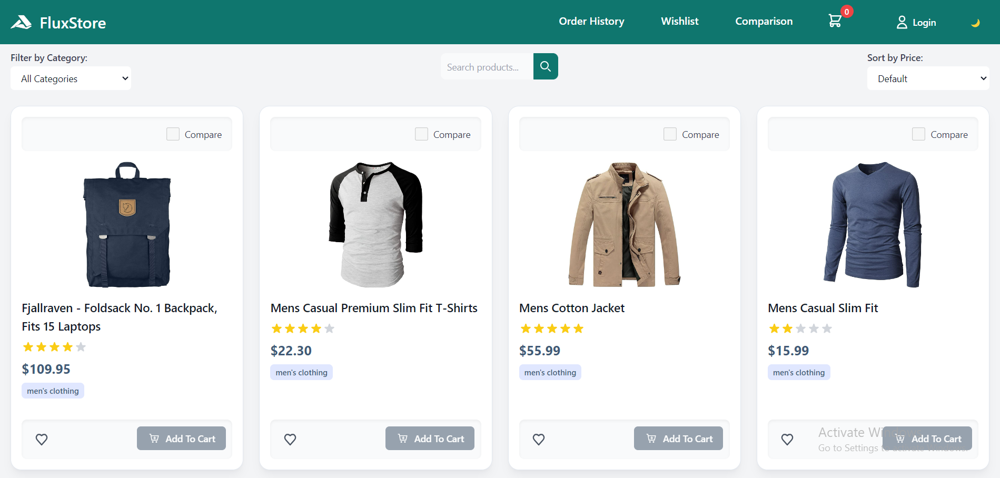
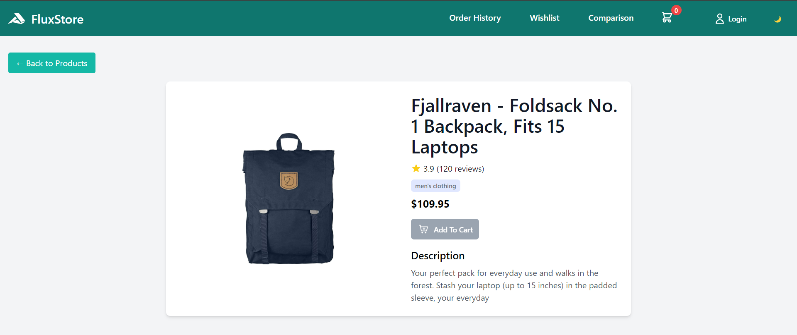

#  **_FluxStore_**

FluxStore is a modern, responsive e-commerce application built with Vue 3 and styled using Tailwind CSS. This project demonstrates how to create a dynamic product catalog with features such as product listing, filtering, sorting, and detailed product views.




## Features

- Responsive grid layout for product display
- Product filtering by category
- Price-based sorting (ascending and descending)
- Detailed product view page
- Loading spinners for improved user experience
- State management using Pinia

## Technologies Used 🛠️

- [Vue 3](https://v3.vuejs.org/) - The progressive JavaScript framework for building user interfaces
- [Tailwind CSS](https://tailwindcss.com/) - A utility-first CSS framework for rapid UI development
- [Vite](https://vitejs.dev/) - Next generation frontend tooling
- [Pinia](https://pinia.vuejs.org/) - The intuitive store for Vue.js
- [Vue Router](https://router.vuejs.org/) - The official router for Vue.js

## Project Structure

```
FluxStore
|-- public
|   |-- accusoft-svgrepo-com.svg
|-- src
    |-- assets
    |   |-- HomePage_vue.png
    |   |-- ProductDetail_Vue.png
    |-- components
    |   |-- CategoryFilter.vue
    |   |-- Header.vue
    |   |-- PriceSort.vue
    |   |-- ProductCard.vue
    |   |-- ProductDetailSkeleton.vue
    |   |-- ProductGrid.vue
    |   |-- SearchBar.vue
    |   |-- SkeletonLoader.vue
    |   |-- StarRating.vue
    |-- router
    |   |-- index.js
    |-- store
    |   |-- FilterSortStore.js
    |   |-- ProductStore.js
    |-- views
        |-- Cart.vue
        |-- Home.vue
        |-- Login.vue
        |-- ProductDetail.vue
        |-- Wishlist.vue
     |-- App.vue
     |-- main.js
     |-- style.css
|-- .gitignore
|-- index.html
|-- package.json
|-- postcss.config.js
|-- README.md
|-- tailwind.config.js
|-- vite.config.js
```

## Setup Instructions 📃

1. Clone the repository:

   ```
   git clone https://github.com/MohauMushi/Module_4_MOHMUS379_JSE2407_GroupA_Mohau-Mushi_JSF03.git
   ```

2. Navigate to the project directory:

   ```
   cd Module_4_MOHMUS379_JSE2407_GroupA_Mohau-Mushi_JSF03
   ```

3. Install dependencies:

   ```
   npm install
   ```

4. Start the development server:

   ```
   npm run dev
   ```

5. Open your browser and navigate to `http://localhost:5173` (or the port specified in your terminal).

## Usage

### Browsing Products

- The home page (`HomeView.vue`) displays a grid of product cards.
- Each card shows the product image, title, price, and category.
- Click on a product card to view more details on the ProductDetailView page.

### Filtering and Sorting

- Use the `CategoryFilter` component to filter products by category.
- Use the `PriceSort` component to sort products by price (ascending or descending).

### Searching Products

- Use the `SearchBar` component to search for specific products.

### Loading States

- The `SkeletonLoader` component is used to display loading states while data is being fetched.

## State Management

- The `FilterSortStore.js` store manages the state for filtering and sorting operations using Pinia.
- The `ProductStore.js` store handles the product data and related operations using Pinia.

## Routing

- Vue Router is used for navigation between different views.
- Route definitions can be found in `src/router/router.js`.

## Styling

- Tailwind CSS is used for styling components.

## _Contributing_

Contributions are welcome! Please feel free to submit a Pull Request.
